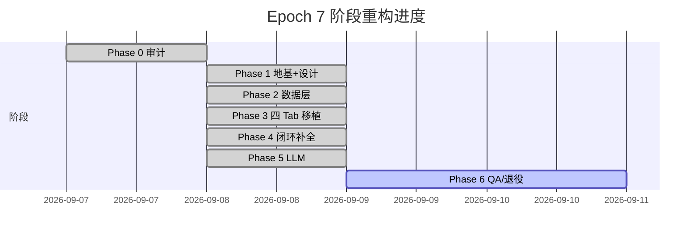

# Epoch 迁移记录（Phase 0–6）

> 实施期记录。Phase 6（当前）完成时打 `phase-6-final` tag；Phase 5 出口前打 `phase-5-final` tag 作回滚锚点。
> 状态：Phase 6 实施中。早期阶段产物以 git tag / git log 为准，本文件为决策与回滚说明。

---

## Phase 进度



> 上图为示意；实际各 phase 用时见 git log 提交密度。

---

## Phase 0 · 全仓库审计（2026-09-07 → 2026-09-08）

**入口文档**：
- `docs/product-audit-2026-09-07.md`
- `docs/design-audit-2026-09-07.md`
- `docs/form-audit-2026-09-08.md`
- `docs/visual-system-research-2026-09-08.md`
- `docs/particle-bg-research-2026-09-08.md`
- `docs/epoch-full-audit-2026-09-08.md`（汇总）

**核心结论**：
- 现状：`legacy.html` 单文件 4,125 行（245KB），JSON blob 存 `app_state` 表。
- 13 套 jsdom 测试语义全量需移植。
- 5 个 P0 阻断（见 `epoch-full-audit-2026-09-08.md` §5）。
- `src.legacy/` 是更早的 MUI 死代码（45 文件）。

**决策**（用户拍板，2026-09-08）：
1. 弃单文件架构，迁移 React 19 + Vite + TS + react-router + TanStack Query + Zustand + i18next。
2. 引入真实 LLM：Cloudflare Pages Function 服务端代理，默认 Workers AI（免费额度）+ OpenAI 兼容适配器预留。
3. 视觉归一优先（Paper Mono 取代 Soft Glass Aurora）。
4. AI 只产 Proposal，走 Preview→Confirm→Apply，永不直接写库。

---

## Phase 1 · 工程地基 + 设计系统（2026-09-08）

**产物**：
- `package.json` + `package-lock.json`（npm 锁定）
- `tsconfig.json` + `vite.config.ts`
- `src/main.tsx` + `src/app/{AppShell,router,app-shell.css}`
- `src/design/{tokens,global}.css`（Paper Mono token 全表）
- `src/components/ui/*`（20 个组件：Button/IconButton/Card/Panel/Sheet/Row/TlRow/Toast/...）
- `src/lib/{ai-client,dates,i18n,supabase,theme}.ts`
- `src/shared/ai-schema.ts`（zod schema，前后端共享）
- `src/test/setup.ts`（jsdom polyfills：PointerEvent / matchMedia / scrollTo）
- 路由：`/today` `/plan` `/progress` `/me` `/goal/:id` `/health` `/dev/style`（lazy + Suspense）

**设计定版**：
- `docs/design-direction-2026-09-08.md`（Paper Mono 取代 Soft Glass）
- 浅色画布 #F7F8FA + 墨色 pill 主按钮 + accent 绿 #5BAE82 仅限完成/活跃
- Inter Variable 本地打包（@fontsource-variable/inter）+ lucide-react 图标
- 八级 elevation + 五档圆角 + 七级字阶

**出门校验**：build 绿 + 7 路由可达。

---

## Phase 2 · 数据层（2026-09-08）

**产物**：
- `supabase/migrations/0001..0005.sql`：
  - `0001_init.sql`：基础 schema
  - `0002_preview_features.sql`：预览功能
  - `0003_profiles.sql`：profile
  - `0004_app_state.sql`：旧 JSON blob（**保留**，永不删）
  - `0005_norm.sql`：**正式表**（directions / goals / tasks / routines / habit_logs / inbox_items / reviews）
- `src/lib/supabase.ts`（client + RLS 边界）
- `src/services/migrate.ts`：
  - 旧 key `epoch-state` → 备份到 `epoch-backup-legacy`（**不删**）
  - 幂等标记 `epoch-migrated-v2`（跳过标志）
  - 7 步迁移规则：done → completedAt、goal/routine 标题关联、habit chip 合并、history → dayStats、review → reviews[weekKey]、theme/lang 迁新键
- `src/services/{queries,actions,store,sync}.ts`（Zustand 6 slice + 同步层）

**红线**：旧 `app_state` 永不删除；可回滚（`migrate.ts` 备份键 + `app_state` 双写）。

---

## Phase 3 · 四 Tab 移植（2026-09-08）

**产物**：
- `src/features/today/{TodayPage,TodayHeader,Dash,TaskSheet}.{tsx,css}`
- `src/features/plan/{PlanPage,PlanMyDaySheet,planMyDay}.{tsx,ts,css}`
- `src/features/progress/{ProgressPage,progress.css}`
- `src/features/me/{MePage,me.css}`
- `src/features/goals/{GoalPanel,GoalSheet,goal-panel.css,goal-sheet.css}`
- `src/features/health/{HealthPanel,health-panel.css}`
- `src/features/onboarding/Onboarding.tsx`
- `src/features/habits/RoutineSheet.tsx`
- `src/features/focus/{FocusVeil,focusStore,focus.css}`

**特性**：
- 全部 lazy 加载（`router.tsx` `lazy(() => import(...))`）
- 路由级 Suspense（fallback `<div className="is-loading" aria-hidden="true" />`）
- 6 状态切片：goal / task / inbox / review / suggestion / ui

**出门校验**：4 Tab 端到端可用（方向、目标、任务、打卡、复盘）。

---

## Phase 4 · 闭环补全（2026-09-08）

**产物**（在 Phase 3 基础上补）：
- 方向/目标/例程 CRUD（解决 Phase 0 C2 死端）
- 周复盘回填（解决 C1 Review→Adjust 单窄路）
- Plan My Day 真实生成（解决 C4 假模板）
- 健康数据接入占位（明确标注 Demo，未连原生层）

**出门校验**：核心 5 闭环（方向 / 目标 / 计划 / 完成 / 复盘 / 调整）端到端为真。

---

## Phase 5 · LLM 接入（2026-09-08）

**产物**：
- `functions/api/ai.ts`（Cloudflare Pages Function，单文件，~135 行）
- 2 个 provider：Workers AI（默认）/ OpenAI 兼容回退
- zod 白名单校验（`aiResponseSchema.safeParse`）
- `src/lib/ai-client.ts`：
  - `buildAIContext()` 从 Zustand 序列化真实数据
  - `requestAI(ability)` POST `/api/ai`
  - 拒绝记忆（localStorage `epoch-ai-rejected`，去重最近 100 条）
- `src/components/ui/AIPreview.tsx`（diff 视图）
- `src/features/ai/AISuggestSheet.tsx`（Today 顶部建议卡）

**三能力**：`plan_day` / `sort_inbox` / `review_observer`

**红线**：
- AI key 只在 `functions/api/ai.ts` 出现
- AI 只产 Proposal，用户逐条确认才落库
- AI 不可用不影响产品其余功能

**出门校验**：三能力都能拿到 zod 合法的 Proposal；503 / 502 时前端正常降级。

---

## Phase 6 · QA + 收尾（2026-09-09 至今）

**计划文件**：`artifacts/plan.md`（任务前的实现计划）

**目标**：
- 7 档断点视觉无回归
- a11y 全覆盖
- 性能守住 220KB gzipped
- 三条主线 E2E 全绿
- CI 自动化
- legacy 一次性清除
- 文档四件套沉淀

### 6.1 实施日志

| PR | 内容 | 状态 | 文件 |
|---|---|---|---|
| PR-1 | 文档骨架（design-direction §7 组件矩阵 + ai-architecture + migration-log） | ✓ | `docs/design-direction-2026-09-08.md`（追加 §7）/ `docs/ai-architecture.md`（新增）/ `docs/migration-log.md`（本文件） |
| PR-2 | ESLint 配置 + 修首批 warning | 待开工 | `.eslintrc.cjs` / `package.json` |
| PR-3 | size-limit 配置 + CI step | 待开工 | `.size-limit.json` / `ci.yml` |
| PR-4 | a11y：axe + keyboard spec + CI job | 待开工 | `tests/a11y/**` / `playwright.config.ts` / `ci.yml` |
| PR-5 | E2E 三主线 + CI job | 待开工 | `tests/e2e/**` / `playwright.config.ts` / `ci.yml` |
| PR-6 | 视觉基线：pixelmatch + 7 viewport spec + baseline 入库 + CI job | 待开工 | `tests/visual/**` / `playwright.config.ts` / `ci.yml` |
| PR-7 | legacy 引用检查 CI step | 待开工 | `scripts/check-no-legacy-refs.mjs` / `ci.yml` |
| PR-8 | legacy 删除（前置 PR-7 绿） | 待开工 | `git rm legacy.html` + `git rm -r src.legacy/` + 改 `package.json` + 清 `NetBackground.tsx` 注释 |
| PR-9 | 出门校验 + `phase-6-final` tag | 待开工 | tag + release notes |

### 6.2 删除清单

**Phase 6 PR-8 一并清除**：

| 路径 | 大小 | 来源 | 处置 |
|---|---|---|---|
| `legacy.html` | 245,625 B（4,125 行） | Phase 0 审计前唯一上线版 | `git rm`；Cloudflare Pages 旧部署 URL 保留 |
| `src.legacy/` | 45 文件（MUI 死代码） | Phase 1 之前的更早 React 实现 | `git rm -r` |
| `tests/*.test.mjs`（13 套） | jsdom legacy 套件 | Phase 0 审计时识别为"语义需移植" | **直接删除**（8 个新 vitest spec 已覆盖核心路径；不移植） |
| `package.json` 的 `legacy:inject` / `legacy:serve` 脚本 | 2 行 | 旧部署辅助 | **只删 scripts 字符串**，**不动 `scripts/inject.mjs`**（仍在 Cloudflare Pages 构建用） |
| `src/components/NetBackground.tsx` 中的"legacy"注释 | 1 行 | 文档残留 | 删该行注释 |

### 6.3 回滚 tag

| Tag | 触发时机 | 用途 |
|---|---|---|
| `phase-5-final` | **PR-8 前必打** | legacy 删除前的回滚锚点；旧 `app_state` 仍可访问 |
| `phase-6-final` | **PR-9 末尾** | Phase 6 全部出门后打；标记可对外发布 |

回滚命令（紧急时）：

```bash
# 回滚到 Phase 5 出口（保留 legacy.html 与 src.legacy/）
git checkout phase-5-final

# 回滚到 Phase 6 出口（删了 legacy 之后）
git checkout phase-6-final
```

数据回滚：旧 `app_state` 永远不删，`migrate.ts` 备份键 `epoch-backup-legacy` 与 `epoch-migrated-v2` 标记保留；切换 tag 不影响数据。

---

## 7. 已知限制（Out-of-scope，Phase 7+ 缓议）

来自 brief 决策（2026-09-08）+ Phase 6 计划 §范围外：

- **Projects 实体**：现行 spec 用 routines 替代；闭环未稳前不加管理层。
- **全局搜索 / CommandMenu**：docs 明令不做；P1 缓议。
- **通知系统**：无真 PWA 前是空承诺。
- **PWA manifest + SW**：Vite 化后随手可加；Phase 7 缓议。
- **真实健康数据接入**：需原生层（iOS HealthKit / Android Health Connect）；维持 Demo 标注。
- **AI 流式（SSE）**：当前 await 一次性；Phase 7 评估。
- **AI 对话记忆**：当前单请求无 chat history；Phase 7 缓议。
- **rejection memory 清理 UI**：当前 localStorage 自管；Me 页"重置 AI 建议"按钮 Phase 7 加。

---

## 8. 文档索引

| 主题 | 文档 |
|---|---|
| 产品总览 | `docs/epoch-spec-v1.md` |
| 视觉方向（Paper Mono） | `docs/design-direction-2026-09-08.md` |
| 设计系统提案（旧） | `docs/design-system-proposal.md` |
| AI 架构 | `docs/ai-architecture.md` |
| 迁移记录（本文件） | `docs/migration-log.md` |
| 审计 | `docs/epoch-full-audit-2026-09-08.md` |
| 产品审计 | `docs/product-audit-2026-09-07.md` |
| 设计审计 | `docs/design-audit-2026-09-07.md` |
| 表单审计 | `docs/form-audit-2026-09-08.md` |
| 视觉研究 | `docs/visual-system-research-2026-09-08.md` |
| 粒子背景研究 | `docs/particle-bg-research-2026-09-08.md` |

---
*定版框架随 Phase 6 推进更新；最新交付状态以 `phase-6-final` tag 为准。*
